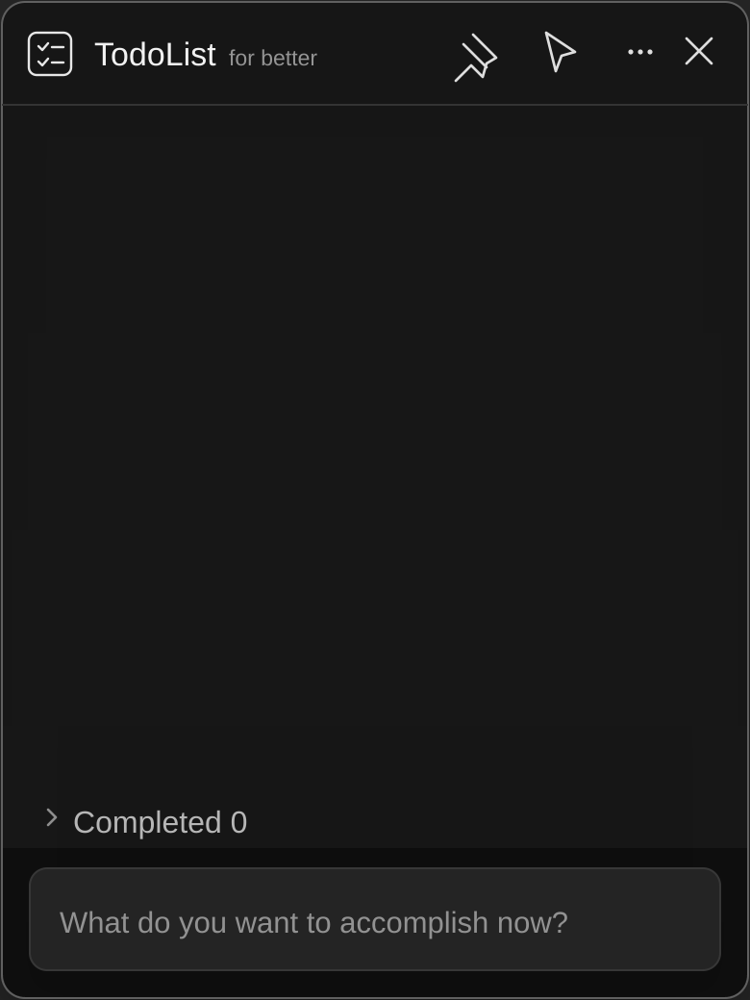

# keList - Windows 桌面待办清单

> **for better**

一款专注、轻量的 Windows 桌面待办工具。  
黑白灰玻璃面板常驻桌面，把要做的事留在眼前，同时尽量减少打扰。



## 📥 下载

- **GitHub Releases**：[下载最新版本](https://github.com/keke-vs/KeList/releases)

下载 `keList-v*-win-x64.zip`，解压后运行 `keList.exe` 即可，无需安装 .NET 运行库。

---

## ✨ 功能特点

- **简单的双状态清单**：待办与已完成两个状态，完成项自动进入底部折叠区域
- **快速记录**：在底部输入框写下事项，按 Enter 即可添加
- **直接编辑**：待办文字可直接修改，按 Enter 保存，按 Esc 退出编辑
- **拖拽排序**：自由调整待办顺序，用位置表达优先级
- **误删撤销**：删除后短时间内可一键恢复
- **窗口置顶**：让清单始终显示在其他普通窗口上方
- **鼠标穿透**：启用后可直接操作清单后方内容，并可用快捷键安全恢复
- **自由缩放**：窗口宽高、字体大小和背景透明度均可调整
- **窗口锁定**：防止误拖动和误缩放
- **状态记忆**：自动保存窗口位置、尺寸、字号、透明度和清单内容
- **系统托盘**：支持显示/隐藏、置顶、鼠标穿透、开机启动和退出
- **本地优先**：数据仅保存在本机，不需要账号，不收集遥测

---

## 🖱️ 操作说明

| 操作 | 方法 |
|------|------|
| **添加待办** | 点击底部输入框 → 输入内容 → 按 Enter |
| **编辑待办** | 点击待办文字直接修改 → 按 Enter 保存 |
| **完成 / 恢复** | 点击待办左侧圆形复选框 |
| **删除待办** | 鼠标悬停在条目上 → 点击右侧删除按钮 |
| **撤销删除** | 删除后点击底部出现的「Undo」 |
| **拖拽排序** | 悬停条目 → 按住拖动手柄 → 移动到目标位置 |
| **移动窗口** | 鼠标拖动标题栏空白区域 |
| **调整窗口大小** | 拖动窗口四边或四角 |
| **调整字体大小** | 更多菜单中的 `− / +`，或按住 Ctrl 滚动鼠标滚轮 |
| **调整透明度** | 更多菜单 → Background opacity |
| **锁定窗口** | 更多菜单 → Lock position and size |
| **置顶 / 取消置顶** | 点击标题栏图钉按钮，或使用托盘菜单 |
| **开启鼠标穿透** | 点击标题栏鼠标穿透按钮 |
| **退出鼠标穿透** | 按 `Ctrl + Alt + P`，或使用托盘菜单 |
| **显示窗口** | 双击系统托盘中的 keList 图标 |
| **隐藏窗口** | 点击标题栏关闭按钮，窗口将隐藏到系统托盘 |
| **完全退出** | 托盘图标右键 → Exit |

---

## 🖥️ 系统要求

- **操作系统**：Windows 10 1809 或更高版本
- **推荐环境**：Windows 11，可获得完整的亚克力玻璃背景效果
- **处理器架构**：x64
- **运行依赖**：无，自包含版本下载即用

---

## 💾 数据存储

清单和设置会自动保存到：

```text
%LOCALAPPDATA%\keList\data.json
```

每次成功保存前，上一份数据会备份为：

```text
%LOCALAPPDATA%\keList\data.backup.json
```

数据采用易读的 JSON 格式，可自行备份。旧版 `%LOCALAPPDATA%\TodoList` 数据会在首次运行时自动迁移。

---

## 🚀 开机启动

在系统托盘中的 keList 图标上右键，勾选 **Start with Windows** 即可。

> 开机启动记录的是当前 `keList.exe` 的实际路径。移动程序后，请取消勾选并重新启用，以更新启动路径。

---

## 🔧 从源码构建

```powershell
# 编译 Release 版本
dotnet build .\src\keList\keList.csproj -c Release

# 发布自包含单文件版本
dotnet publish .\src\keList\keList.csproj `
  -c Release `
  -r win-x64 `
  --self-contained true `
  -p:PublishSingleFile=true `
  -p:IncludeNativeLibrariesForSelfExtract=true `
  -o .\publish\keList-win-x64
```

- **技术栈**：C# / WPF / .NET 10
- **界面风格**：Windows 11 Acrylic / 黑白灰单色设计

---

## 📄 开源许可

本项目采用 [MIT License](LICENSE)。
